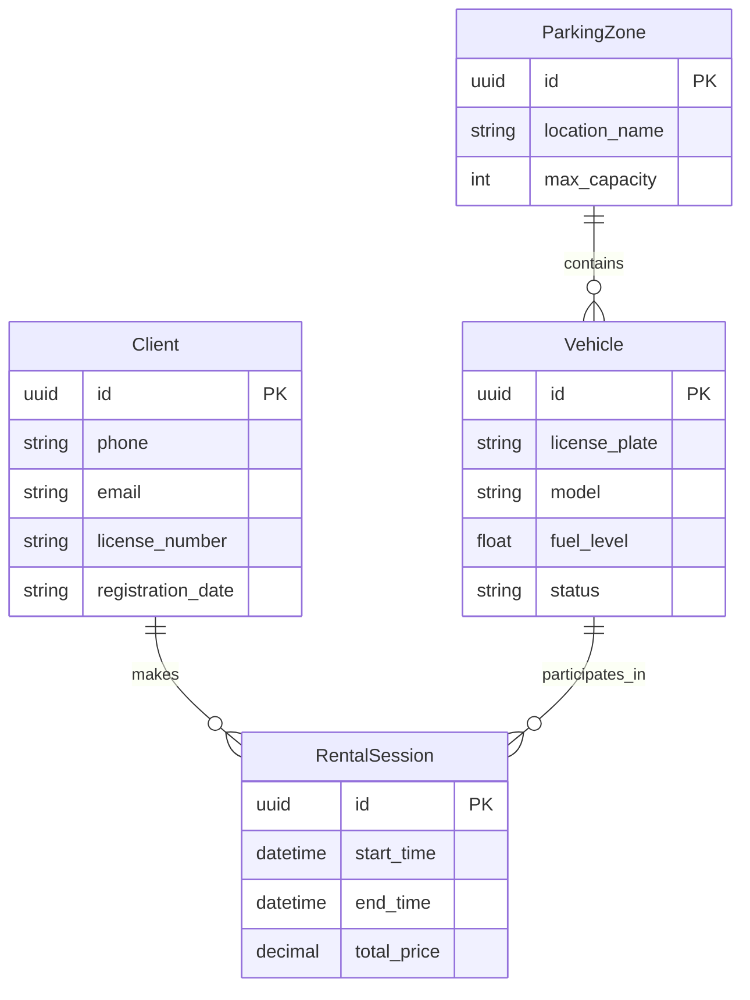

```mermaid
erDiagram
    Client {
        uuid id PK
        string phone
        string email
        string license_number
        string registration_date
    }

    Vehicle {
        uuid id PK
        string license_plate
        string model
        float fuel_level
        string status
    }

    ParkingZone {
        uuid id PK
        string location_name
        int max_capacity
    }

    RentalSession {
        uuid id PK
        datetime start_time
        datetime end_time
        decimal total_price
    }

    Client ||--o{ RentalSession : makes
    Vehicle ||--o{ RentalSession : participates_in
    ParkingZone ||--o{ Vehicle : contains
```